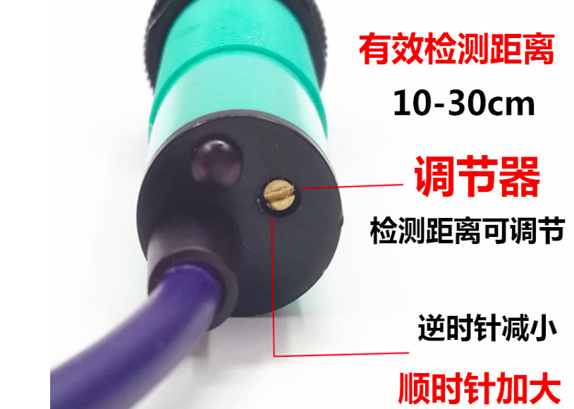

# 红外光电开关传感器

参考网站

[参考01](https://item.taobao.com/item.htm?spm=a230r.1.14.103.48dc6c91jfxiRq&id=527070300777&ns=1&abbucket=6#detail)  [参考02](https://www.sohu.com/a/216548608_796852)  [参考03](https://www.ncnynl.com/archives/201610/918.html)


[TOC]


## 1.环境配置

### 1.1 硬件

淘宝链接可见 [link](https://item.taobao.com/item.htm?spm=a230r.1.14.103.48dc6c91jfxiRq&id=527070300777&ns=1&abbucket=6#detail) 以下数据仅供参考

红外漫反射式光电开关传感器E3F-DS30C4

电压 6~36V

感应范围 10cm - 30cm

- 接线

  

- 调整感应距离

  

### 1.2 软件

- 安装 `Arduino` IDE

  > sudo apt-get install arduino

  通过 `arduino` 语句打开IDE, 会自动在根目录添加目录 `sketchbook/`

- 安装 `Arduino` 开发库

  - 通过 `apt-get` 安装

    > sudo apt-get install ros-kinetic-rosserial-arduino
    > 
    > sudo apt-get install ros-kinetic-rosserial

  - 通过源码安装

    > cd <catkin_ws>/src
    >
    > git clone https://github.com/ros-drivers/rosserial.git
    >
    > cd <catkin_ws>
    >
    > catkin_make

- 关联 `ROS` 与 `Arduino` 库

  >  cd <sketchbook>/libraries
  >  
  >  rm -rf ros_lib   // 之前如果有可以删除
  >  
  > rosrun rosserial_arduino make_libraries.py .

  注意语句最后有一个 `.`

- 查看 `ros_lib` 库

  重启 arduino , 点击 `file` --- `ros_lib` 可以看到已经安装的库


## 2.程序说明

### 2.1 大致原理

`arduino` IDE将写好的程序通过 `upload` 写入 `arduino` 开发板的内存

使用 `rosrun rosserial_python serial_node.py _port:=<port_name>` 语句

调用 `ros` 包来启动开发板内存中的程序

### 2.2 注意端口权限

第一次进行 `upload` 操作时, 会弹出找不到端口的错误

这时需要给端口赋予权限

但同时会找不到存在的端口

需要进行如下操作

增加当前用户对串口的默认访问权限

> sudo usermod -a -G dialout 用户名

使UDEV配置生效

> sudo service udev reload
>
> sudo service udev restart

重启机器即可


### 2.3 源代码

实例代码(不能直接用)

```c++
/* 
 * rosserial IR Ranger Example  
 * 
 * This example is calibrated for the Sharp GP2D120XJ00F.
 */

#include <ros.h>
#include <ros/time.h>
#include <sensor_msgs/Range.h>

ros::NodeHandle  nh;
sensor_msgs::Range range_msg;
ros::Publisher pub_range( "range_data", &range_msg);

const int analog_pin = 0;
unsigned long range_timer;

/*
 * getRange() - samples the analog input from the ranger
 * and converts it into meters.  
 */
float getRange(int pin_num){
    int sample;
    // Get data
    sample = analogRead(pin_num)/4;
    // if the ADC reading is too low, 
    //   then we are really far away from anything
    if(sample < 10)
        return 254;     // max range
    // Magic numbers to get cm
    sample= 1309/(sample-3);
    return (sample - 1)/100; //convert to meters
}

char frameid[] = "/ir_ranger";

void setup()
{
  nh.initNode();
  nh.advertise(pub_range);
  
  range_msg.radiation_type = sensor_msgs::Range::INFRARED;
  range_msg.header.frame_id =  frameid;
  range_msg.field_of_view = 0.01;
  range_msg.min_range = 0.03;
  range_msg.max_range = 0.4;
  
}

void loop()
{
  // publish the range value every 50 milliseconds
  //   since it takes that long for the sensor to stabilize
  if ( (millis()-range_timer) > 50){
    range_msg.range = getRange(analog_pin);
    range_msg.header.stamp = nh.now();
    pub_range.publish(&range_msg);
    range_timer =  millis();
  }
  nh.spinOnce();
}
```

看注释可知, 改代码是对于 `Sharp GP2D120XJ00F` 解析使用的

但由于我们的传感器是开关型传感器

不需要数据, 只需要 `0` 或 `1` 的信号

所以不需要解析

可将代码改为如下

```c++
#include <ros.h>
#include <ros/time.h>
#include <sensor_msgs/Range.h>

ros::NodeHandle  nh;
sensor_msgs::Range range_msg;
ros::Publisher pub_range( "infrared_data", &range_msg);

const int analog_pin = 0;
unsigned long range_timer;

int getRange(int pin_num){
    int sample;
    sample = analogRead(pin_num);
    return sample;
}

char frameid[] = "/infrared_frame";

void setup()
{
  nh.initNode();
  nh.advertise(pub_range);
  
  range_msg.radiation_type = sensor_msgs::Range::INFRARED;
  range_msg.header.frame_id =  frameid;
  range_msg.field_of_view = 0.01;
  range_msg.min_range = 0.01;
  range_msg.max_range = 10;
  
}

void loop()
{
  // publish the range value every 50 milliseconds
  //   since it takes that long for the sensor to stabilize
  if ( (millis()-range_timer) > 50){
    range_msg.range = getRange(analog_pin);
    range_msg.header.stamp = nh.now();
    pub_range.publish(&range_msg);
    range_timer =  millis();
  }
  nh.spinOnce();
}
```


## 3.运行

将代码复制到IDE

点击 `upload` , 待成功后

依次运行如下命令

打开终端

> roscore

运行节点

> rosrun  rosserial_python serial_node.py _port:=<port_name>

接下来便可以使用`rostopic echo` 语句来查看数据


