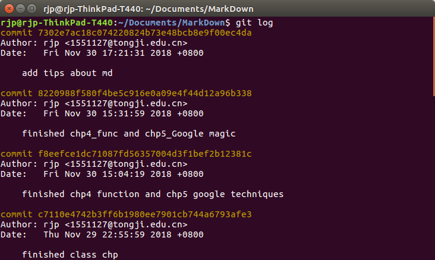
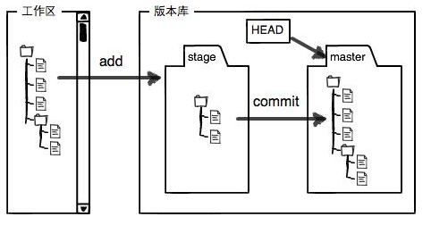
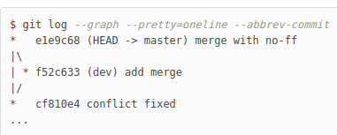

# Git Learning Notes

参考于

[廖雪峰官网](https://www.liaoxuefeng.com/wiki/0013739516305929606dd18361248578c67b8067c8c017b000/001374027586935cf69c53637d8458c9aec27dd546a6cd6000 "前往")

[CSDN_01](https://www.cnblogs.com/libertycode/p/5858450.html "前往") [CSDN_02](https://www.cnblogs.com/ydxblog/p/7988317.html "前往")

以廖雪峰官网为框架，CSDN作为补充

适合已经大致掌握Git的同学进行复习使用

## 0.目录

[TOC]

---

## 1.简介

分布式版本控制系统与集中式版本控制系统

- 集中式版本控制

  版本库是集中存放在中央服务器的，而干活的时候，用的都是自己的电脑，所以要先从中央服务器取得最新的版本，然后开始干活，干完活了，再把自己的活推送给中央服务器。

  - 必须要联网，工作时受到网速的限制
  - 安全性差
  - 不方便多人协作

- 分布式版本控制

  分布式版本控制系统根本没有“中央服务器”，每个人的电脑上都是一个完整的版本库，这样，你工作的时候，就不需要联网了，因为版本库就在你自己的电脑上

  - 无需联网，但需要联网去方便交换
  - 安全性强
  - 方便多人协作

### 1.1 安装Git

在终端输入`git`

查看是否安装Git

安装后，需要配置Git的用户设置

`git config --global user.name "Your Name"`

`git config --global user.email "email@example.com"`

### 1.2 创建版本库

在终端中打开工作文件夹，输入`git init`完成初始化

使用把工作文件夹中的所有内容添加到暂存区（后面会提到）`git add .`

再把暂存区的内容提交到分支（后面会提到）`git commit -m "note"`

## 2.时光穿梭机

使用Git进行版本的控制和管理

在终端中输入`git status`查看已经初始化的工作文件夹的git状态

### 2.1 版本回退

- 使用`git log`命令查看Git的日志文件

  Git的日志文件使用commit_id来记录每一个版本的版本号

  不使用数字，而使用SHA1计算出来的一个非常大的数字，16进制显示

  是出于多人协作的考虑

  

  `git log --pretty=oneline`

  添加参数`--pretty=oneline`，可以得到简化的Git log

  `git log --graph --pretty=oneline --abbrev-commit`

  也可以得到图表表达的Git log

- 版本回退`git reset`命令

  `git reset --hard HEAD^`其中一个`^`代表回退一个版本

  如果想回退到前n个版本可使用`git reset --hard HEAD~<n>`

  回退到某一指定版本`git reset --hard <commit_id>`

  回退后的后悔药`git reflog`

  可以看到自己输入的命令，从中可以找到新版本的序列号

### 2.2 工作区和暂存区

工作区是你电脑中的文件夹

通过add将工作区添加的暂存区

再通过commit命令同意提交，将暂存区的内容提交到分支

### 2.3 撤销修改

- 未add到暂存区

  `git checkout -- <file_name>`

- add到暂存区

  `git reset HEAD <file_name>`

  `git checktout -- <file_name>`

- add到暂存区还commit

  请参考[2.1 版本回退](#2.1 版本回退)

### 2.4 删除文件

`git rm <file_name>`

## 3.远程仓库

Git强于集中式系统的地方在此

> 你肯定会想，至少需要两台机器才能玩远程库不是？但是我只有一台电脑，怎么玩？
>
> 其实一台电脑上也是可以克隆多个版本库的，只要不在同一个目录下。不过，现实生活中是不会有人这么傻的在一台电脑上搞几个远程库玩，因为一台电脑上搞几个远程库完全没有意义，而且硬盘挂了会导致所有库都挂掉，所以我也不告诉你在一台电脑上怎么克隆多个仓库。
>
> 实际情况往往是这样，找一台电脑充当服务器的角色，每天24小时开机，其他每个人都从这个“服务器”仓库克隆一份到自己的电脑上，并且各自把各自的提交推送到服务器仓库里，也从服务器仓库中拉取别人的提交。
>
> 完全可以自己搭建一台运行Git的服务器，不过现阶段，为了学Git先搭个服务器绝对是小题大作。好在这个世界上有个叫[GitHub](https://github.com/)的神奇的网站，从名字就可以看出，这个网站就是提供Git仓库托管服务的，所以，只要注册一个GitHub账号，就可以免费获得Git远程仓库。

请自行注册GitHub账号。由于你的本地Git仓库和GitHub仓库之间的传输是通过SSH加密的

SSH设置

- 创建SSH key

  `ssh-keygen -t rsa -C "youremail@example.com"`

  一路回车就好

- 登录GitHub，打开账户设置，在SSH Keys里面设置

  把根目录下的`.ssh`目录里面的`id_rsa.pub`内容复制就可以

### 3.1 添加远程库

- 先在GitHub创建新的库

- 在本地已经初始化的工作空间运行

  `git remote add <RemoteName> git@<url>`

  其中`url`是新的库地址

- 把本地库的内容推到GitHub

  `git push -u origin master`

### 3.2 从远程库克隆

在你想要的工作空间中使用`git clone`命令

`git clone <url>`

## 4.分支管理

>分支在实际中有什么用呢？假设你准备开发一个新功能，但是需要两周才能完成，第一周你写了50%的代码，如果立刻提交，由于代码还没写完，不完整的代码库会导致别人不能干活了。如果等代码全部写完再一次提交，又存在丢失每天进度的巨大风险。
>
>现在有了分支，就不用怕了。你创建了一个属于你自己的分支，别人看不到，还继续在原来的分支上正常工作，而你在自己的分支上干活，想提交就提交，直到开发完毕后，再一次性合并到原来的分支上，这样，既安全，又不影响别人工作。
>
>其他版本控制系统如SVN等都有分支管理，但是用过之后你会发现，这些版本控制系统创建和切换分支比蜗牛还慢，简直让人无法忍受，结果分支功能成了摆设，大家都不去用。
>
>但Git的分支是与众不同的，无论创建、切换和删除分支，Git在1秒钟之内就能完成！

### 4.1 创建与合并分支

- `git branch`查看分支

- `git branch <new_branch>`创建分支

- `git branch -d <branch>`删除某一分支

- `git checkout <branch>`切换到某一分支

- `git checkout -b <new_branch>`创建并切换到新分支

- `git merge <branch>`合并分支到当前分支，注意此时是快速合并`fast forward`

- `git merge --no-ff -m "note" <branch>`不使用`fast forward`合并分支

  两者的区别在于，`fast forward`合并在`git log`图中没有合并表示，是一条线

  而关闭后，`git log`中两个分支的合并会有两条线变成一条线

  

### 4.2 解决合并冲突

通过`git status `命令来查看冲突

修改冲突后，记得`git add`和`git commit`

### 4.3 多人协作

`git remote`命令对远程操作

- `git remote -v`
- `git remote add <RemoteName> <url>`添加远程库
- `git remote rm <RemoteName>`删除远程库

- `git remote update origin prune` 如果有了新的远程库分之, 但是找不到可以用这个语句 

以下，默认只有一个远程库，远程库名字是`origin`

`git push`命令推送分支

- `git push -u origin master`直接推到远程的master

- `git push origin <LocalBranch>:<RemoteBranch>`将本地的分支推送的远程分支

- `git push origin :<RemoteBranch>`相当于删除远程分支

`git checkout`抓取远程分支

- `git checkout -b <NewLocalBranch> origin/<RemoteBranch>`

`git pull `直接合并，如果设置了追踪

如果`git pull`提示`no tracking information`，则说明本地分支和远程分支的链接关系没有创建，使用`git branch --set-upstream-to <LocalBranch> origin/<BranchName>`命令建立本地库和远程分支的关联

## 5 自定义Git

在git工作空间的根目录创建`.gitignore`文件

在里面记录不需要跟踪的文件夹和文件

文件夹`FolderName/`记住有斜杠

文件`Folder1/Folder2/file`