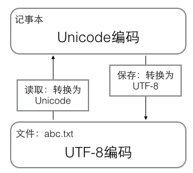
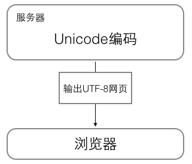

# Python Learning Note

[python教程 廖雪峰](https://www.liaoxuefeng.com/wiki/0014316089557264a6b348958f449949df42a6d3a2e542c000/001431611988455689d4c116b2c4ed6aec000776c00ed52000)

[TOC]

## 0.简介

高级编程语言, 通常会提供一个比较完善的基础代码库, 可以直接调用

应用: 网络应用(网站, 后台服务), 小工具(脚本), 其他语言程序的再包装

解释型语言, 速度慢, **代码不能加密**(只有源码, 不像c有机器码)


## 1.基础

### 1.1 第一个小程序

命令行和Python交互模式

`print()` 和 `input()` 函数

### 1.2 缩进 

`:` 结尾, 视作代码块(相当于C++的 `{}` )

```python
a = 100
if a>= 0:
    print(a)
else:
    print(-a)
```

使用空格缩进, 4个空格

大小写敏感

### 1.3 变量

整形, 浮点, 字符串(不变), 布尔, 空值, 变量, 常量

字符串注意转义符 `\`

布尔 `and` `or` `not`

Python是动态语言, 更加灵活

```python
a = 'ABC'
b = a	# pointer in cpp
a = 'XYZ'
print(b) # ABC
```

```python
9 / 3	# 3.0 浮点除
10 // 3	# 3 取整除
10 % 3	# 1 取余
```

注意赋值的时候, python在内存中地址的操作是按照指针来, 但是后续又不影响

所以但从现象来看, 倒像是两个类型的对象

### 1.4 字符编码

`ASCII` 编码: 127个字符, 1个字节, 只支持英文和某些字符

`Unicode` 编码: 解决多语言的乱码, 但是存储和传输不便

`UTF-8` 编码: 根据不同字符大小编码成1-6个字节, 英文1个字节, 汉子3个字节, 节省空间

记事本打开时的编码转换




网站打开时的编码转换



python字符是 `Unicode` 编码, 支持多语言

```python
ord('A') # 65 ord()获取字符的整数表示
ord('中')	# 20013
chr(66)	# 'B' chr()编码转换为字符
# 十六进制还能这么写
'\u4e2d\u6587'	# '中文'
```

内存中 `str` 以 `Unicode` 表示, 网络传输或者保存磁盘, 需要转换成以字节为单位的 `bytes`

可以使用 `encode` 把 `str` 编码为指定的 `byte`

可以使用`decode` 把 `byte` 变成 `str`

```python
x = b'ABC'
y = 'ABC'
'abc'.encode('ascii')	# b'abc'
'任家平'.encode('utf-8')	# b'\xe4\xbb\xbb\xe5\xae\xb6\xe5\xb9\xb3'
b'abc'.decode('ascii')	# 'abc'
b'\xe4\xbb\xbb\xe5\xae\xb6\xe5\xb9\xb3'.decode('utf-8') # '任家平'
```

在 `.py` 的首行可以写

```python
#!/usr/bin/env python3
# _*_ coding:utf-8 _*_
```

第1行告诉Linux系统, 这是一个Python可执行程序

第2行告诉Python解释器, 按照 `UTF-8` 读取源码, 否则会有乱码, 前提是写入文件也用的是 `UTF-8`

### 1.5 格式化

在字符串内部使用 `%` 运算符进行字符串格式化

```python
# %s 字符串替代, %d 整数替代
# %f 浮点数替代, %x 16进制证书
'Hi, %s, you fucked up' % 'RJP'
'hi, %s, you have %d' % ('RJP', 1000)
# 整数的位数和0格式化, 还有浮点数的小数位格式化
print ('%2d-%02d' % (3,1))	#  3-01
print ('%.2f' % 3.1415926)	# 3.14
```

在现在的实验里面, `print()` 只能给一个语句格式化

`%` 格式化符号只格式化前面紧跟的字符串

### 1.6 `List` 和 `tuple`

`list` 和cpp的 `vector` 用法差不多,   

不同的是 `list` 可以通过负数的索引, 从后到前取值

```python
l = ['r', 'j', 'p']
print (l[-1])	# 'p'
```

如果 `list` 长度是 `n`, 那么索引范围是 `0` 到 `n-1`, `-n` 到 `-1` 

```python
list.append('123')
list.insert(pos,'123')	# pos 0~n-1
list.pop(pos = n-1);
list = ['123', 1, True]
list = ['123', 1, ['r', True], False]
list = []
```

`tuple` 和 `list` 大致相同, 没有 `append()` 和 `insert()` 

`tuple` 的元素不可变, 无法在除了初始化以外的位置赋值

```python
tuple = ('r', 'j', 'p')
tuple = ()
tuple = (1)	# 歧义, 此时定义的不是tuple而是1, 因为语义有冲突, python默认小括号计算
tuple = (1,)	# 因此为了避免歧义

tuple = ('a', 'b', ['A', 'B'])
tuple[2][0] = 'X'
tuple[2][1] = 'Y'	# 合法
```

注意, `list` 和 `tuple` 元素的内存地址是伪线性, 相同类型的相连变量内存地址是连续的, 但是一旦元素类型不同, 内存地址会出现跳变

### 1.7 条件判断, 循环, 

`if` , `elif` , `else`  

```python
l = ['j', 'r', 'p']
for i in l:
    print (i)
    
n = 1
while (n < 100):
    print (n)
    n = n + 1
    if (n > 10):
        break
```

循环语句的 `break` 和 `continue` 的用法和cpp一样

### 1.8 `dic` 和 `set`

`dic` 相当于cpp的 `map`, 映射

```python
# 无序, 类型任意
d = {1:22, 3:321, 'rjp':'fd'}
print (d['rjp'])

# 此时只要不是 d[0], 其他索引值都是1222
d = {0:, 222:'fdasf', True:1222}
```

`dic` 通过 `Hash` 算法通过 `key` 来计算 `value` , `key` 不能变

`set` 无重复对象

### 1.9 函数

关于函数的一些基础

```python
# 函数的调用
abs(5.3)
a = abs	# 随时定义函数的引用
a(-7.9)

# 函数的定义
def my_abs(x):
    if not isinstance(x,(int, float)):	# 检查参数的正确性
        raise TypeError('wrong type')	# 如果没有该句, 传入str会在if报错
    if (x >= 0):
        return x
    else:
        return -x
    
from test_class import func()

# 多个返回值的函数
import math
def move(x, y, step, angle = 0):	# 缺省
    nx = x + step * math.cos(angle)
    ny = y + step * math.sin(angle)
    return nx, ny
# (6.0, 0.0) 返回的是一个元组 tuple

# 函数缺省参数
def power(x, n = 2) 
```

不同于Cpp的地方: 可变参数

```python
# 可变参数
def calc(numbers):
    sum = 0
    for n in numbers:
        sum = sum + n * n
    return sum
calc([1,2,3])

def calc(*numbers):	# 这不是指针
    sum = 0
    for n in numbers:
        sum = sum + n * n
    return sum
calc(1,2,3)	# 使用可变参数后,将传入的参数装进tuple
calc()	# 0   相当于可以直接重载多个参数

n = [1,2,3]	# 如果声明了可变参数, 但是还是的传入列表
calc(*n)	# 在调用函数时, 给参数前面加一个 * 即可, 这种写法很常见
```

关键字参数

```python
# 关键字参数
# 本质也是一个可变参数, 把数据装进了dic, 是传值, 深拷贝
def person(name, age, **kw):
    print('Name:', name, 'age:', age, 'other:', kw)

person('rjp', 22)	# Name: rjp age: 22 other: {}

# 直接使用可变参数类型没有单引号, 赋值用等于号
person('rrr', 21, city = 'xian', sex_tend = 'gay') 

# 直接传入dic的时候, 使用两个星号
ddd = {'city':'shanxi', 'job':'teacher'}
person('kk', 32, **ddd)
```

命名关键字参数

```python
# 命名关键字参数
# 针对关键字参数进行筛选, 只能输入想要的参数
def person(name, age, *, city, job):	# * 后面是限制的参数
    print(name, age, city, job)

# 正常调用
person ('rjp', 21, city = 'xm', job = 't')	

# 报错, 不存在sex_tend参数
person ('jj', 22, sex_tend = 'fdf', city = 'jj', job = 'kk')
```

### 1.10 递归

```python
# 一般的递归
def fact(n):
    if n == 1:
        return 1
    else:
        return n * fact(n-1)
```

上述的递归是通过栈(Stack)这种数据结构实现的, 递归调用次数过多, 会导致栈的溢出

解决方案是通过**尾递归**优化, 把每一步的成绩传入到递归函数去

```python
def fact(n):
    return fact_iter(n, 1)
def fact_iter(num, product):
    if num == 1:
        return product
    return fact_iter(num - 1, num * product)
```

虽然具体原理不懂, 但是这么做应该没什么大问题


## 2.高级特性

简单的代码实现复杂的功能

### 2.1 切片

通过 `:` 更加快捷的取出 `list` 之中的数据, 返回值是 `list`, 不改变原数据

`tuple` 切片的返回值依然是 `tuple`

```python
list = [0, 1, 2, 3, 4, 5, 6, 7, 8, 9]
# start_pos & end_pos [0, len - 1]
# 包括start_pos自己, 不包括end_pos
# 步长为step
list[start_pos:end_pos:step]	
# instance
list[0:3] = list[:3]	# 从0的位置读到2(3-1)的位置: [0, 1, 2]
list[::2]	# 每隔两个取一个

```

写一个 `trim` 函数, 去掉字符串两端的空格

```python
def trim_string(str):
    if str[0] == ' ' and str[-1] == ' ':
        return trim_string(str[1:-1])
    elif str[0] == ' ' and str[-1] != ' ':
        return trim_string(str[1:])
    elif str[0] != ' ' and str[-1] == ' ':
        return trim_string(str[:-1])
    else:
        return str
```


### 2.2 迭代

```python
d = {'a': 1, 'b': 2, 'c': 3}
for key in d.keys():
    print (key)

for value in d.values():
    print (value)

for k,v in d.items():
    print (k,v)
```


### 2.3 列表生成式

如果要生成 `[1, 4, 9, 16, 25, 36,..., 100]`

使用语句 `[x * x for x in range(1,11)]`

还可以添加条件判断 `[x * x for x in range(1,11) if x % 2 == 0]`


`for` 循环可以一次两个变量, 如 `dic` 的 `item` , 列表生成式也可以

`[m + n for m in 'ABC' for n in 'XYZ']`

`[k + '=' + v for k, v in dic.items()] `


列表生成式里面也可以使用各种方法

`[s.lower() for s in List]`

`[s.lower() for s in List if isinstance(s, str)]`


### 2.4 生成器

通过列表生成器, 可以直接创建复杂的列表

如果列表够长, 但只需要使用列表的前几个元素, 会造成空间的浪费

如果列表元素可以根据某种算法推算出来, 不必创建完整的列表, 可以在循环的过程中推算除后续元素

边计算边循环的机制叫做 `generator`


定义 `generator` 方法:

- 列表表达式的 `[]` 变成 `()`

  `g = (x * x for x in range(10))` 之后用 `for` 把它 `print` 出来

- 函数包含 `field` 关键字

  ```python
  def fib(max):
      n, a, b = 0, 0, 1
      while n < max:
          yield b
          a, b = b, a+b
          n = n + 1
      return 'done'	# 不会有返回值, 是因为返回值在 StopIterartion 中
  ```


### 2.5 迭代器

可用于 `for` 循环的数据类型有:

一类是集合数据类型, 如 `list`, `tuple` , `dic` , `set` , `str`

一类是生成器, `generator` 和 `generator function`

他们统称为 `可迭代对象` Iterable


可以使用 `next()` 的都是迭代器

<font color= red> **WTF**</font>


## 3 函数式编程


  